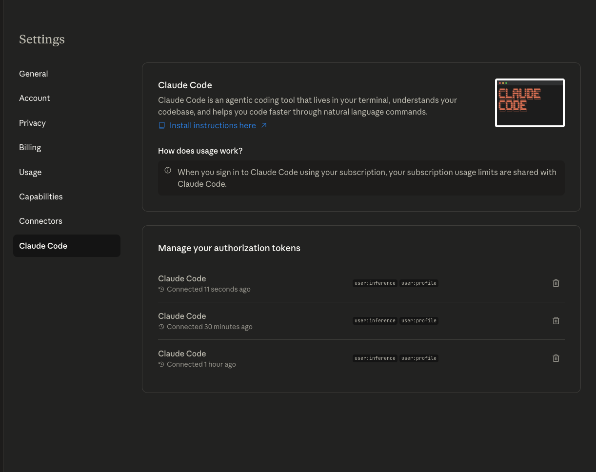

# Architecture Diagrams the Easy Way

Do you hate writing UML but LOVE understanding architecture in a visual way?

Do you hate drag and drop tools that try to make it "easier"?

Why don't you use AI to generate what you think with words?

The purpose of this project is to get you to try doing just that.

I setup a containerized version of claude code with plantUML installed as a demo.  This isn't supposed to be more than that.  Set it up in your own local environment if you like it.

# Prereqs

- Install Docker 
    [Linux](https://docs.docker.com/engine/install/)
    [Mac/Windows](https://docs.docker.com/desktop/)

# Start the Container

`docker compose up -d`

`docker exec -it plantuml-claude bash`

# Prompt Claude

`claude`

This will take you through an auth process.  There is no browser and the docker is headless, so you'll have to copy and past the link to one on your machine and authorize use in the container.

WARNING: Each time you reauth claude will create a new auth token here.  Keep the container up if you plan to use this prototype for non-prototype behavior.  I haven't thought of a clever way to get around this.  The pro plan doesn't seem to allow you to create a self managed token.

Prompt Claude with something like:

Generate a plantUML diagram named test-diagram for me that shows.....

# Generating Diagram

`plantuml test-diagram.puml`
